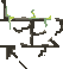

# Tower of Hanoi
A web-based version of a famoius "Tower of Hanoi" game (primary focus on keyboard controls). My main goal was to re-fresh my coding skills/memory and to do something new. I had fun trying some pixel art for the first time, and plan on keep doing it.

Animations and some arts (canvas background, towers and its disks, wrappers for text and options) are still in-progress.
