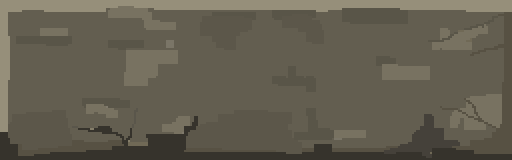

# Tower of Hanoi
A web-based version of a famous "Tower of Hanoi" game (primary focus on keyboard controls). My main goal was to refresh my coding skills/memory and to do something new. I had fun trying some pixel art for the first time, and I plan to keep doing it. Here are some examples of me trying to make some stone texture (a background sprite and a button container):

Animations and some arts (canvas background, towers and its disks, wrappers for text and options) are still in progress.

[Check Tower of Hanoi out](https://jnannni.github.io/Hanoi_Tower/)
